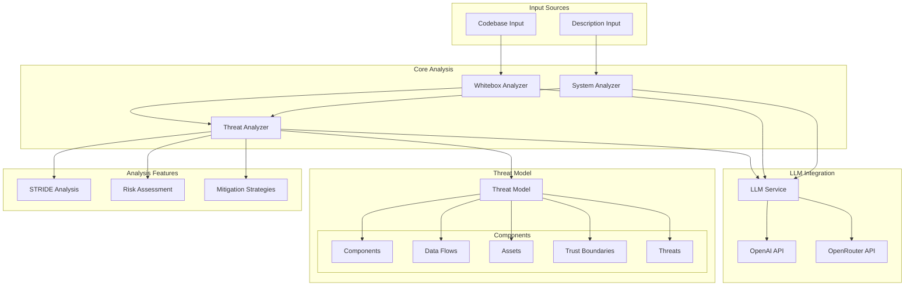

# Arrows : AI Agent for Threat Modeling

AI-driven threat modeling tool that helps identify and analyze security threats in your application architecture following the STRIDE methodology.

## Features

- **AI-Powered Analysis**: Leverages advanced language models to analyze application descriptions and codebases
- **Interactive Visualization**: Dynamic network graph showing components, data flows, and trust boundaries
- **Comprehensive Threat Detection**: Identifies potential security vulnerabilities using STRIDE methodology
- **Multiple Analysis Modes**:
  - Description-based analysis
  - Codebase analysis (whitebox)
- **Detailed Threat Reports**: Includes risk levels, mitigations, and affected components

## Project Architecture



## Prerequisites

- Python 3.8 or higher
- API key from either OpenAI or OpenRouter

## Installation

1. Clone the repository:
```bash
git clone https://github.com/yacwagh/arrows.git
cd ai-threat-modeling
```

2. Install dependencies:
```bash
pip install -r requirements.txt
```

3. Set up environment variables:
Create a `.env` file in the root directory with your preferred API configuration:

For OpenAI:
```
USE_OPENAI=true
OPENAI_API_KEY=your_openai_api_key_here
```

For OpenRouter:
```
USE_OPENAI=false
OPENROUTER_API_KEY=your_openrouter_api_key_here
```

## Usage

### Web Interface

1. Start the web server:
```bash
python app.py
```

2. Open your browser and navigate to `http://localhost:5000`

3. Choose your analysis method:
   - **Description Analysis**: Provide a detailed description of your application, an example is in application.txt
   - **Codebase Analysis**: Upload a ZIP file containing your application code, an example is in react-app/ that needs to be zipped

4. Select your preferred LLM model for analysis (gpt is the fatest, claude 3.7 is the best but also the most expensive)

5. View the interactive visualization and threat analysis results

## Project Structure

```
arrows/
├── app.py                 # Flask web application
├── main.py               # Main entry point
├── llm/                  # LLM integration
│   ├── llmConfig.py     # LLM configuration
│   └── prompts.py       # LLM prompts
├── system_architecture/  # System analysis
│   ├── system_analyzer.py
│   └── whitebox_analyzer.py
├── threat_model/        # Threat modeling folder with python files
├── static/             # Static files
│   ├── css/
│   └── js/
├── templates/          # HTML templates
└── requirements.txt    # Python dependencies
```

## Technologies Used

- **Backend**:
  - Python 3.8+
  - Flask
  - OpenAI/OpenRouter API (LLM integration)
  - Vis.js (Network visualization)

- **Frontend**:
  - HTML5
  - CSS3 (with modern dark theme)
  - JavaScript (ES6+)
  - Bootstrap 5
  - Vis.js

## More to come

- Other frameworks (PASTA, DREAD...)
